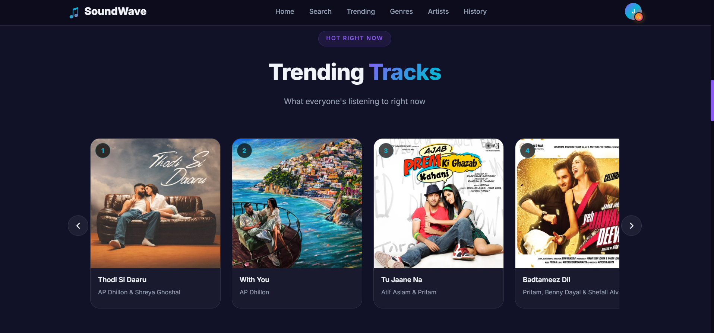

# 🎵 SoundWave – Full Stack Music Discovery Web App

SoundWave is a modern full-stack music discovery web application powered by the iTunes Search API and Firebase services. Users can search songs, explore trending music, preview tracks, and securely manage accounts with authentication and database integration.

---

## 🚀 Live Demo

🔗 (https://soundwavi.netlify.app/)

---

## 📸 Screenshot

---

## ✨ Features

### 🎧 Music Discovery
- Search songs, albums, and artists
- Real-time results using iTunes API
- 30-second audio previews
- Trending music section
- Genre & artist exploration

### 🔐 Authentication
- User registration & login
- Firebase Authentication (Email/Password)
- Secure session handling with cookies
- Persistent login state

### ☁️ Database
- Firebase Realtime Database integration
- Store user information securely
- Manage user-specific data

### 🎨 UI/UX
- Modern gradient hero section
- Clean and responsive design
- Smooth animations and transitions
- Mobile-friendly layout

---

## 🏗️ Tech Stack

### Frontend
- HTML5
- CSS3
- Vanilla JavaScript (ES6+)

### Backend & Services
- iTunes Search API
- Firebase Authentication
- Firebase Realtime Database
- Browser Cookies (Session Management)

---

## 📂 Project Structure

